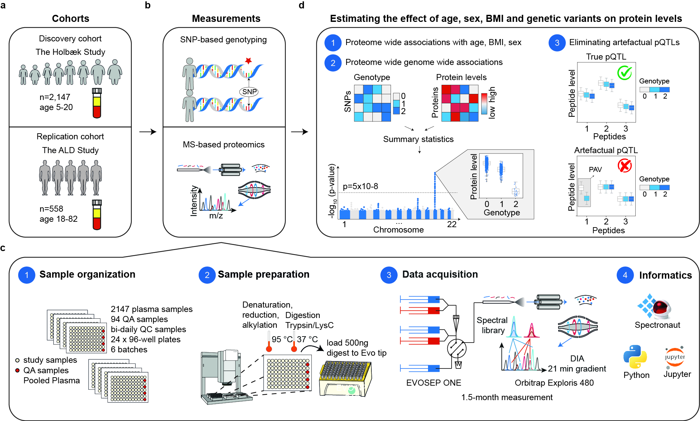

# pQTL_HolbaekStudy

- Link to repository: [github.com/llniu/pQTL_HolbaekStudy](https://github.com/llniu/pQTL_HolbaekStudy)
- Link to preprint on medRxiv: [Plasma Proteome Variation and its Genetic Determinants in Children and Adolescents](https://www.medrxiv.org/content/10.1101/2023.03.31.23287853v1)
- Searchable results at [proteomevariation.org](http://proteomevariation.org/)
- summary of custom scripts used for diverse analysis in the project
- 2,147 children and adolescents in the discovery cohort
- 588 adults with alcohol-related liver diseasse in the replication cohort
- Datasets generated and used in this study include SNP-based genotyping, plasma proteomics, clinical data and phenotypic data.

## Contents

file                      | description
------------------------- | --------------------------------------
[Phenotype-protein association analysis](Phenotype-protein-association/target.ipynb)    | Contains data pre-processing, association tests between levels of plasma proteins and age, sex and BMI SDS. Some functionality is loaded from [`src`](Phenotype-protein-association/src)
[Genome-wide association analysis](Genotype-protein-association/scripts.txt) | Contains scripts used for genome wide association analyis and clumping precedure.
[Genome-wide association analysis - downstream](Genotype-protein-association/pqtl.ipynb)    | Contains custom scripts used for summarizing proteome-wide GWAS results.

## Disclaimer

The complete genotype-, proteomics- and clinical data are available from the authors upon reasonable request.

## Summary of the study

