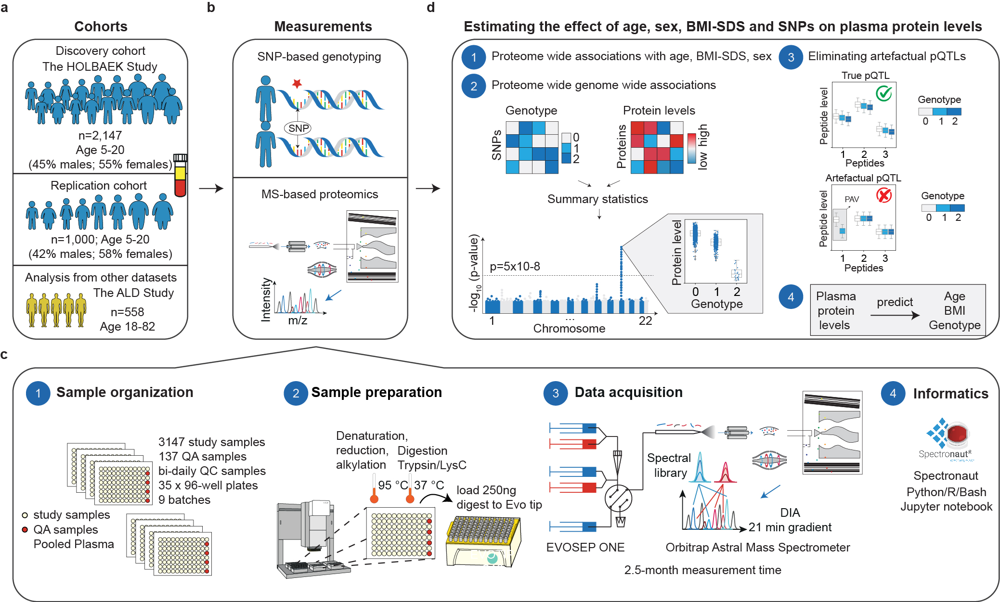

# pQTL_HolbaekStudy

- Link to repository: [github.com/llniu/pQTL_HolbaekStudy](https://github.com/llniu/pQTL_HolbaekStudy)
- Link to preprint on medRxiv: [Plasma Proteome Variation and its Genetic Determinants in Children and Adolescents](https://www.medrxiv.org/content/10.1101/2023.03.31.23287853v1)
- GWAS summary statistics at [GCST90452001-GCST90453000](https://ftp.ebi.ac.uk/pub/databases/gwas/summary_statistics/GCST90452001-GCST90453000/) and [GCST90454001-GCST90455000](https://ftp.ebi.ac.uk/pub/databases/gwas/summary_statistics/GCST90454001-GCST90455000/)
- Searchable results at [proteomevariation.org](http://proteomevariation.org/)
- 2,147 individuals with normal weight and obesity aged 5-20 in the discovery cohort 
- 1,000 individuals with normal weight and obesity aged 5-20 in the replication cohort 
- 588 adults with alcohol-related liver diseasse in the replication cohort
- Datasets generated and used in this study include SNP-based genotyping, plasma proteomics, clinical data and phenotypic data.
- summary of custom scripts used for diverse analysis in the project

## Contents

file                      | description
------------------------- | --------------------------------------
[Phenotype-protein association analysis](Phenotype-protein-association/target_discovery_proteomics_data_processing.ipynb)    | Contains data pre-processing, association tests between levels of plasma proteins and age, sex and BMI SDS. Some functionality is loaded from [`src`](Phenotype-protein-association/src)
[Genome-wide association analysis](Genotype-protein-association/scripts.txt) | Contains scripts used for genome wide association analyis and clumping precedure.
[Genome-wide association analysis - downstream](Genotype-protein-association/pqtl-NG.ipynb)    | Contains custom scripts used for summarizing proteome-wide GWAS results.

## Disclaimer

Complete individual level genotype-, proteomics- and clinical data cannot be made publicly available due to GDPR governance, but GWAS summary statistics and searchable results are available. For individual level data access please refer to data availability section of the published manuscript. 

## Summary of the study

